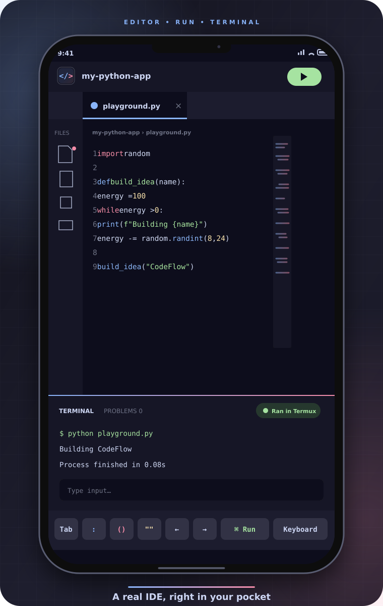
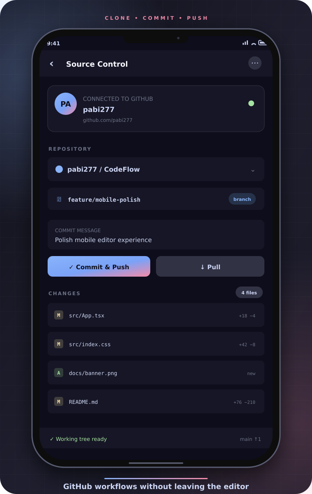
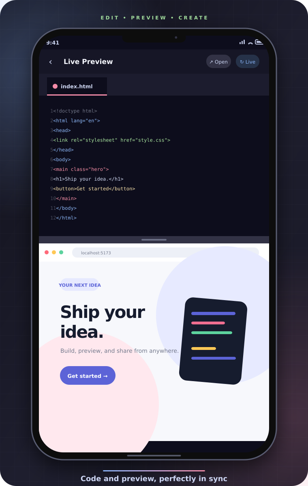
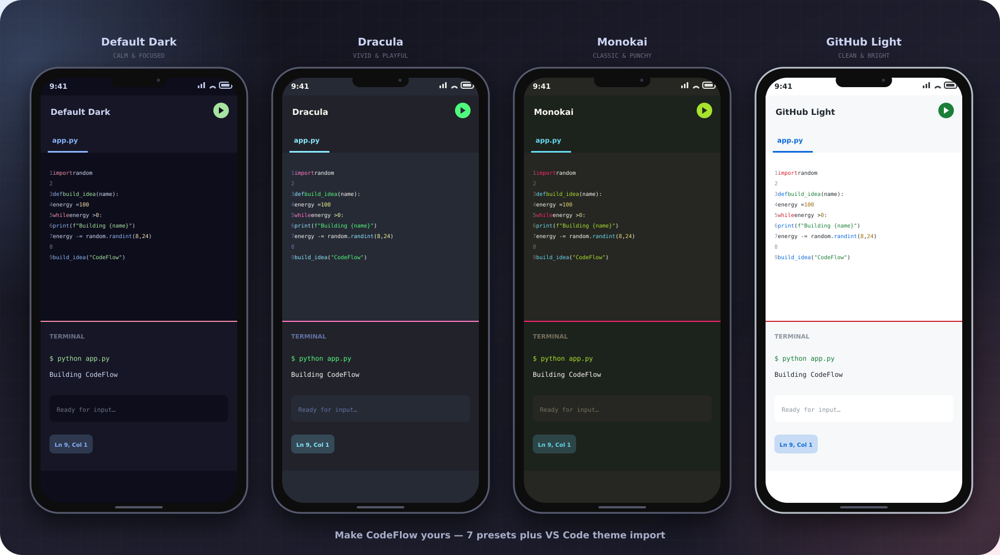

<p align="center">
  
</p>

<p align="center">
  <b>A free, open-source, mobile-first code editor.</b>
  <br /><br />
  Write Python, JavaScript, HTML and more — right from your phone.
  <br />
  Run code, preview the web, push to GitHub. Works offline.
</p>

<p align="center">
  <a href="https://code-flow-gamma-liard.vercel.app">🌐 Try it now</a> •
  <a href="#features">✨ Features</a> •
  <a href="#screenshots">📱 Screenshots</a> •
  <a href="#getting-started">🚀 Get started</a> •
  <a href="CONTRIBUTING.md">🤝 Contribute</a>
</p>

<p align="center">
  <a href="LICENSE"></a>
  <a href="CONTRIBUTING.md"></a>
  <a href="https://code-flow-gamma-liard.vercel.app"></a>
</p>

---

## 📱 Screenshots

<p align="center">
  
  
  
</p>

<p align="center">
  
</p>

## ✨ Features

### ✏️ Editor

- CodeMirror 6 with 20+ languages
- Multi-cursor, Emmet, and rainbow brackets
- 7 theme presets — or import your own
- Minimap, sticky scroll, and indent guides

### ▶️ Run Code

- JavaScript runs instantly in the browser
- Python, C, Java, Go, and more via Termux — free and offline
- Judge0 cloud execution with your own API key
- Interactive `stdin` / `input()` support

### 🌐 Live Preview

- HTML/CSS/JS preview with split view
- CSS, JavaScript, and images load from your project
- Termux live server for full-fidelity previews

### 🔀 GitHub

- OAuth connect, clone, commit, push, and pull
- Branch switching, diff viewer, and conflict resolver
- Upload local projects to GitHub
- Git history and pull request viewer

### 📱 Mobile First

- Touch-optimized keyboard toolbar
- File explorer with a `⋮` menu on every item
- Installable PWA that keeps working offline
- Zen mode for distraction-free coding

### 🧰 IDE Essentials

- Project-wide search and replace
- Problems panel, outline, breadcrumbs, and status bar
- Snippets, format-on-save, and workspace symbols
- Pinned tabs, run configurations, and execution history

> **No app store. No subscription. No laptop required.** Open CodeFlow in your browser and start building.

---

<details id="architecture">
<summary><strong>🧱 Architecture</strong></summary>

<br />

CodeFlow is a Vite + React + TypeScript PWA. The editor is powered by CodeMirror 6, app data is stored with Dexie in IndexedDB, and Zustand coordinates application state.

```text
src/
├── components/          Feature-focused React UI
│   ├── Editor/          CodeMirror integration
│   ├── FileExplorer/    Project tree and file actions
│   ├── GitHub/          Repositories and source control
│   ├── Terminal/        Output, stdin, and run history
│   └── Shared/          Reusable controls and modals
├── config/              Defaults, labels, and API settings
├── db/                  Dexie schema and persistence
├── editor/              Languages, themes, and editor extensions
├── hooks/               PWA and application hooks
├── plugins/             Plugin registry and built-ins
├── services/            Execution, GitHub, Judge0, and Termux
├── store/               Zustand application store
├── types/               Shared TypeScript types
└── utils/               Preview, formatting, search, and helpers
```

The included Cloudflare Worker in [`worker/`](worker/) performs the GitHub OAuth code-to-token exchange without exposing a client secret to the browser.

</details>

<details id="data-model">
<summary><strong>🗄️ Data Model</strong></summary>

<br />

CodeFlow stores projects locally in IndexedDB (`CodeFlowDB`), so editing remains fast and available offline.

- **files** — files and folders, content, paths, timestamps, and Git status
- **projects** — root folders and optional GitHub repository metadata
- **settings** — editor, appearance, execution, and integration preferences
- **editorState** — open tabs, active file, cursor position, and terminal state
- **executionHistory** — previous runs and their output
- **gitHubAuth** — OAuth connection data
- **snippets** — reusable, language-aware code snippets

</details>

<details id="running-code">
<summary><strong>▶️ Running Code</strong></summary>

<br />

CodeFlow picks the best available runner automatically:

1. **JavaScript** — runs locally in an isolated browser sandbox with captured console output.
2. **Termux** — runs Python, TypeScript, C/C++, Java, Go, Rust, Node, Bash, and more on Android.
3. **Judge0** — optional cloud execution when an API key is configured.
4. **Setup guidance** — if no real runner is available, CodeFlow explains how to connect one instead of fabricating output.

Enable **Input** in the terminal panel to pass `stdin` to programs. Termux execution supports whole projects, so local imports work as expected.

</details>

<details id="getting-started">
<summary><strong>🚀 Getting Started</strong></summary>

<br />

### Use the hosted app

Open **[code-flow-gamma-liard.vercel.app](https://code-flow-gamma-liard.vercel.app)**. On mobile, choose **Add to Home Screen** or **Install app** to use CodeFlow like a native PWA.

New here? Tap **How does it work?**, then choose **New project (with sample files)**.

### Run locally

Requires a current Node.js release and npm.

```bash
git clone https://github.com/pabi277/CodeFlow.git
cd CodeFlow
npm install
npm run dev
```

Useful commands:

```bash
npm run build     # production build + service worker
npm run preview   # preview the production build
npm run lint      # lint the project
npm run test      # run the full test suite
```

### Configure GitHub OAuth

The GitHub client secret must never ship in frontend code. Deploy the worker in [`worker/`](worker/) and add its secrets:

```bash
cd worker
wrangler deploy
wrangler secret put GITHUB_CLIENT_ID
wrangler secret put GITHUB_CLIENT_SECRET
```

Then configure the client ID and token proxy URL in [`src/services/authService.ts`](src/services/authService.ts), rebuild, and use **Connect GitHub** in the Git panel.

</details>

<details id="termux">
<summary><strong>🖥️ Termux Integration</strong></summary>

<br />

Termux turns your Android device into a free, unlimited, offline code runner. The bridge in [`public/termux-bridge.js`](public/termux-bridge.js) runs on your device and connects CodeFlow to installed compilers and interpreters.

Supported languages include Python, JavaScript, TypeScript, C, C++, Java, Bash, Ruby, PHP, Go, Rust, Kotlin, Perl, and Lua. Runs use a timeout, pipe `stdin`, clean up temporary files, and display the green **Ran in Termux** badge.

Follow the **[5-minute Termux setup guide](docs/termux-setup.md)** or open **Settings → Execution → Termux Integration** inside CodeFlow.

</details>

<details id="tests">
<summary><strong>🧪 Tests</strong></summary>

<br />

```bash
npm run test              # all suites
npm run test:smoke        # screens and application boot
npm run test:git          # clone, status, commit, and pull
npm run test:execution    # local and fallback execution
npm run test:bridge       # Termux bridge and stdin
npm run test:completions  # completion behavior
npm run test:html-preview # local HTML/CSS/JS preview
npm run test:oauth        # OAuth exchange and error handling
npm run test:encoding     # Unicode GitHub round-trips
npm run test:ide          # editor extensions and themes
```

Additional suites cover snippets, ZIP import/export, explorer actions, diagnostics, Markdown, formatting, Emmet, project search, editor history, persistence, and Termux previews.

</details>

<details id="security">
<summary><strong>🔐 Security</strong></summary>

<br />

- The GitHub client secret stays server-side in the OAuth proxy.
- GitHub authentication data is stored in IndexedDB, never in URLs or cookies.
- API calls use HTTPS.
- HTML previews are sandboxed.
- Cloud code runs inside Judge0's sandbox; Termux code runs locally on your device.

Please report vulnerabilities privately using [SECURITY.md](SECURITY.md).

</details>

---

## 🤝 Contributing

Ideas, issues, and pull requests are welcome. Read [CONTRIBUTING.md](CONTRIBUTING.md) and the [Code of Conduct](CODE_OF_CONDUCT.md) to get started.

If CodeFlow makes coding on your phone easier, consider giving the project a ⭐ — it helps more developers discover it.

## 📄 License

[MIT](LICENSE) © CodeFlow contributors.

<p align="center">
  Built with React, CodeMirror 6, Dexie, Zustand, Tailwind CSS, and Vite.
</p>
